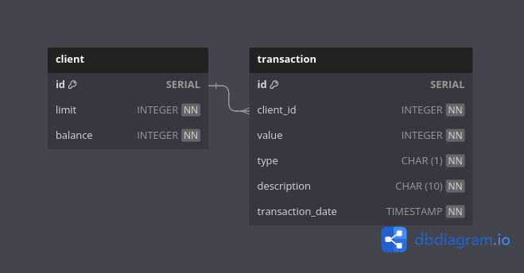

# Rinha Backend 2024 Q1


## Sumário
- [Execução](#execução)
- [Documentação](#documentação)
- [Otimizações](#otimizações)
  - [Dockerfile](#dockerfile)

## Execução

```bash
docker compose up --build
```

## Documentação


[Swagger](docs/swagger.yml)

## [Otimizações](https://www.baeldung.com/spring-boot-startup-speed)

### Dockerfile
`"-XX:+UseParallelGC", "-XX:TieredStopAtLevel=1"`

### Spring Boot
Exclude autoConfiguration classes

